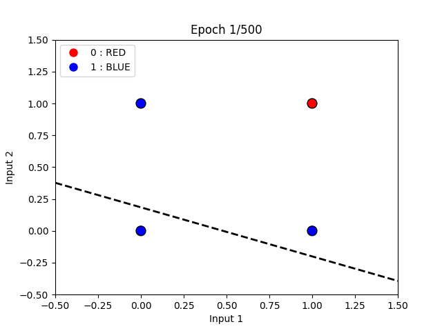
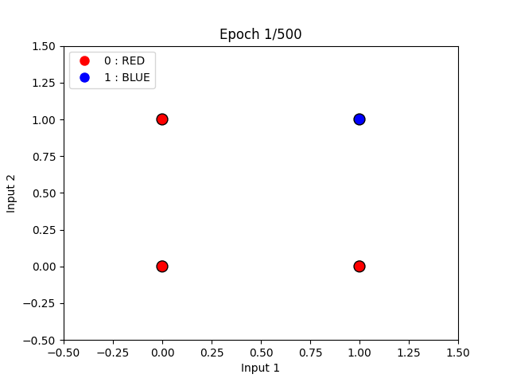
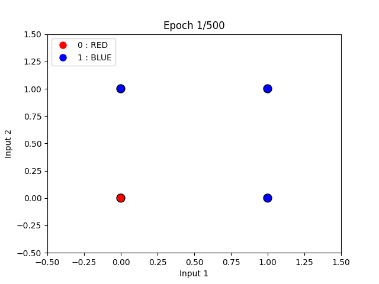
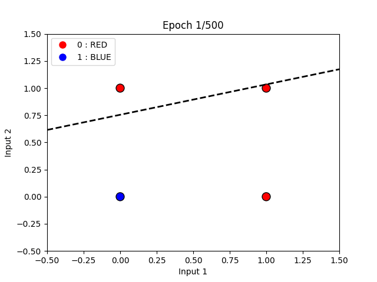
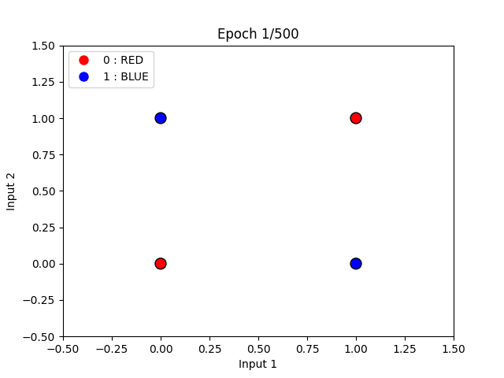

# Perceptron Logic Gate Visualizations

This project demonstrates the implementation of a perceptron to learn basic logic gates (AND, OR, NAND, XOR, XNOR) and provides animated visualizations of the learning process. The animations illustrate how the perceptron updates its weights and bias during training to find the decision boundary for each logic gate.

## Detailed Explanation

### `Simple_Perceptron_NAND.py`

This file contains the implementation of a perceptron specifically designed to learn the NAND gate. The perceptron is initialized with:
- **Input size**: Number of inputs to the logic gate (User can pass this argument at runtime).
- **Learning rate**: Determines the step size for weight updates.
- **Activation function**: Sigmoid function to calculate the output.

The perceptron is trained using the perceptron learning rule:
1. Compute the weighted sum of inputs and bias.
2. Pass the result through the sigmoid activation function.
3. Calculate the error as the difference between the target and the output.
4. Update the weights and bias using the gradient of the error.

### How to run this code -
```Bash
python3 Simple_Perceptron_NAND.py <NUM_INPUTS>
```
At runtime, user can pass argument to realize the number of inputs they want the Gate to be.
For ex:
```Bash
python3 Simple_Perceptron_NAND.py 4
```
This will generate a 4 input NAND Gate.

### Sample Output:
```Bash
Training the perceptron for 4-input NAND logic:
Epoch 0, Loss: 5.031709
Epoch 1000, Loss: 1.005273
Epoch 2000, Loss: 1.002356
Epoch 3000, Loss: 1.001438
Epoch 4000, Loss: 1.000988
Epoch 5000, Loss: 1.000719
Epoch 6000, Loss: 1.000536
Epoch 7000, Loss: 1.000400
Epoch 8000, Loss: 1.000292
Epoch 9000, Loss: 1.000200

Testing predictions:
Input: [0 0 0 0], Predicted: 0.9783, Binary: 1
Input: [0 0 0 1], Predicted: 0.9917, Binary: 1
Input: [0 0 1 0], Predicted: 0.9935, Binary: 1
Input: [0 0 1 1], Predicted: 0.9975, Binary: 1
Input: [0 1 0 0], Predicted: 0.9918, Binary: 1
Input: [0 1 0 1], Predicted: 0.9969, Binary: 1
Input: [0 1 1 0], Predicted: 0.9976, Binary: 1
Input: [0 1 1 1], Predicted: 0.9991, Binary: 1
Input: [1 0 0 0], Predicted: 0.9924, Binary: 1
Input: [1 0 0 1], Predicted: 0.9971, Binary: 1
Input: [1 0 1 0], Predicted: 0.9977, Binary: 1
Input: [1 0 1 1], Predicted: 0.9991, Binary: 1
Input: [1 1 0 0], Predicted: 0.9972, Binary: 1
Input: [1 1 0 1], Predicted: 0.9989, Binary: 1
Input: [1 1 1 0], Predicted: 0.9992, Binary: 1
Input: [1 1 1 1], Predicted: 0.9997, Binary: 1
```


### `visualize_NAND.py`

This file visualizes the learning process of the perceptron for the NAND gate. 
It shows a step-by-step animation showing how the decision boundary evolves as the perceptron updates its weights and bias during training.

- **NAND Gate**  
  

#### Animation Details
The animation illustrates:
- **Data Points**: Red dots represent 0, and blue dots represent 1.
- **Decision Boundary**: A dashed line that separates the two classes.
- **Epoch Progression**: The title of the plot updates to show the current epoch, indicating the training progress.

The animation is saved as a GIF in the `animations` folder.

### Other Logic Gates

Similar to the NAND gate, the repository includes implementations and visualizations for the following gates:
- AND (`Simple_Perceptron_AND.py`, `visualize_AND.py`)
- OR (`Simple_Perceptron_OR.py`, `visualize_OR.py`)
- NOR (`Simple_Perceptron_NOR.py`, `visualize_NOR.py`)
- XOR (`Simple_Perceptron_XOR.py`, `visualize_XOR.py`)

Each gate has its corresponding animation saved in the `animations` folder.

### Example Animations
Below are the animations for all gates:

- **AND Gate**  
  

- **OR Gate**  
  

- **NOR Gate**  
  

---

## Why `Simple_Perceptron_XOR.py` Fails

The XOR gate is not linearly separable, meaning there is no straight line that can separate the two classes in the input space. A single-layer perceptron can only learn linearly separable functions, such as AND, OR, and NAND. 

### Visualization Insights

- **XOR Gate**  
  

In the XOR animation:
- The decision boundary oscillates but never converges to a solution.
- This is because the perceptron cannot find a single line that separates the XOR outputs (class 0 and class 1).

This limitation is inherent to single-layer perceptrons, as they lack the capacity to model non-linear decision boundaries.

---

## Why Two Layers Are Needed for XOR and XNOR Gates

To solve XOR and XNOR gates, we need a multi-layer perceptron (MLP) with at least two layers:
1. **Hidden Layer**: Introduces non-linearity by combining the inputs in a way that makes the output linearly separable.
2. **Output Layer**: Applies the perceptron rule to classify the transformed inputs.

The hidden layer allows the MLP to create intermediate representations of the data, enabling it to learn non-linear functions like XOR and XNOR. This is why a single-layer perceptron fails, but a two-layer perceptron succeeds.

This is demonstrated in the `Multi_Layer_Perceptron_XOR.py` file.

---

## Conclusion

This repository demonstrates the power and limitations of single-layer perceptrons. While they can learn linearly separable functions, they fail for non-linear functions like XOR. The visualizations provide an intuitive understanding of the learning process and the challenges faced by single-layer perceptrons.

## How to Run the Code

1. Clone the repository:
   ```bash
   git clone <repository_url>
   cd <repository_folder>
   ```

2. Install the required Python packages:
   ```bash
   pip install numpy matplotlib
   ```

3. Run the visualization script for the desired logic gate:
   ```bash
   python visualize_<GATE_NAME>.py
   ```
   Replace `<GATE_NAME>` with `AND`, `OR`, `NAND`, `XOR`, or `XNOR`.

4. The animation will be displayed and saved as a GIF in the `animations` folder.

---
