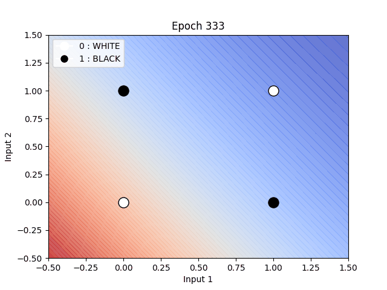

# Perceptron Logic Gate Visualizations

This project demonstrates the implementation of a perceptron to learn basic logic gates (AND, OR, NAND, XOR, XNOR) and provides animated visualizations of the learning process. The animations illustrate how the perceptron updates its weights and bias during training to find the decision boundary for each logic gate.

## Detailed Explanation

### `Simple_Perceptron_NAND.py`

This file contains the implementation of a perceptron specifically designed to learn the NAND gate. The perceptron is initialized with:
- **Input size**: Number of inputs to the logic gate (User can pass this argument at runtime).
- **Learning rate**: Determines the step size for weight updates.
- **Activation function**: Sigmoid function to calculate the output.

The perceptron is trained using the perceptron learning rule:
1. Compute the weighted sum of inputs and bias.
2. Pass the result through the sigmoid activation function.
3. Calculate the error as the difference between the target and the output.
4. Update the weights and bias using the gradient of the error.

### How to run this code -
```Bash
python3 Simple_Perceptron_NAND.py <NUM_INPUTS>
```
At runtime, user can pass argument to realize the number of inputs they want the Gate to be.
For ex:
```Bash
python3 Simple_Perceptron_NAND.py 4
```
This will generate a 4 input NAND Gate.

### Sample Output:
```Bash
Training the perceptron for 4-input NAND logic:
Epoch 0, Loss: 5.031709
Epoch 1000, Loss: 1.005273
Epoch 2000, Loss: 1.002356
Epoch 3000, Loss: 1.001438
Epoch 4000, Loss: 1.000988
Epoch 5000, Loss: 1.000719
Epoch 6000, Loss: 1.000536
Epoch 7000, Loss: 1.000400
Epoch 8000, Loss: 1.000292
Epoch 9000, Loss: 1.000200

Testing predictions:
Input: [0 0 0 0], Predicted: 0.9783, Binary: 1
Input: [0 0 0 1], Predicted: 0.9917, Binary: 1
Input: [0 0 1 0], Predicted: 0.9935, Binary: 1
Input: [0 0 1 1], Predicted: 0.9975, Binary: 1
Input: [0 1 0 0], Predicted: 0.9918, Binary: 1
Input: [0 1 0 1], Predicted: 0.9969, Binary: 1
Input: [0 1 1 0], Predicted: 0.9976, Binary: 1
Input: [0 1 1 1], Predicted: 0.9991, Binary: 1
Input: [1 0 0 0], Predicted: 0.9924, Binary: 1
Input: [1 0 0 1], Predicted: 0.9971, Binary: 1
Input: [1 0 1 0], Predicted: 0.9977, Binary: 1
Input: [1 0 1 1], Predicted: 0.9991, Binary: 1
Input: [1 1 0 0], Predicted: 0.9972, Binary: 1
Input: [1 1 0 1], Predicted: 0.9989, Binary: 1
Input: [1 1 1 0], Predicted: 0.9992, Binary: 1
Input: [1 1 1 1], Predicted: 0.9997, Binary: 1
```


### `visualize_NAND.py`

This file visualizes the learning process of the perceptron for the NAND gate. 
It shows a step-by-step animation showing how the decision boundary evolves as the perceptron updates its weights and bias during training.

- **NAND Gate**  
  

#### Animation Details
The animation illustrates:
- **Data Points**: Red dots represent 0, and blue dots represent 1.
- **Decision Boundary**: A dashed line that separates the two classes.
- **Epoch Progression**: The title of the plot updates to show the current epoch, indicating the training progress.

The animation is saved as a GIF in the `animations` folder.

### Other Logic Gates

Similar to the NAND gate, the repository includes implementations and visualizations for the following gates:
- AND (`Simple_Perceptron_AND.py`, `visualize_AND.py`)
- OR (`Simple_Perceptron_OR.py`, `visualize_OR.py`)
- NOR (`Simple_Perceptron_NOR.py`, `visualize_NOR.py`)
- XOR (`Simple_Perceptron_XOR.py`, `visualize_XOR.py`)

Each gate has its corresponding animation saved in the `animations` folder.

### Example Animations
Below are the animations for all gates:

- **AND Gate**  
  

- **OR Gate**  
  

- **NOR Gate**  
  

---

## Why `Simple_Perceptron_XOR.py` Fails

The XOR gate is not linearly separable, meaning there is no straight line that can separate the two classes in the input space. A single-layer perceptron can only learn linearly separable functions, such as AND, OR, and NAND. 

### Visualization Insights

- **XOR Gate**  
  

In the XOR animation:
- The decision boundary oscillates but never converges to a solution.
- This is because the perceptron cannot find a single line that separates the XOR outputs (class 0 and class 1).

This limitation is inherent to single-layer perceptrons, as they lack the capacity to model non-linear decision boundaries.

---

## Why Two Layers Are Needed for XOR and XNOR Gates

To solve XOR and XNOR gates, we need a multi-layer perceptron (MLP) with at least two layers:
1. **Hidden Layer**: Introduces non-linearity by combining the inputs in a way that makes the output linearly separable.
2. **Output Layer**: Applies the perceptron rule to classify the transformed inputs.

The hidden layer allows the MLP to create intermediate representations of the data, enabling it to learn non-linear functions like XOR and XNOR. This is why a single-layer perceptron fails, but a two-layer perceptron succeeds.

This is demonstrated in the `Multi_Layer_Perceptron_XOR.py` file.

---

### `Multi_Layer_Perceptron_XOR.py`

This file implements a multi-layer perceptron (MLP) to solve the XOR gate problem.
Unlike a single-layer perceptron, the MLP can model non-linear decision boundaries by introducing hidden layers.

#### Key Features:
- **Input size**: Number of inputs to the XOR gate (User can pass this argument at runtime).
- **Hidden layers**: The number of hidden layers and neurons in each layer can be adjusted dynamically.
- **Activation function**: Sigmoid function is used for non-linearity.
- **Learning process**: The MLP uses backpropagation to update weights and biases.

#### How to Run:
```bash
python3 Multi_Layer_Perceptron_XOR.py <NUM_INPUTS>
```

For example:
```bash
python3 Multi_Layer_Perceptron_XOR.py 4
```
This command creates a 4-input XOR gate.

Sample Output -
```Bash
Training XOR MLP with 4 inputs...
Epoch 0, Loss: 4.567186
Epoch 1000, Loss: 2.316423
Epoch 2000, Loss: 1.398171
Epoch 3000, Loss: 0.309107
Epoch 4000, Loss: 0.130773
Epoch 5000, Loss: 0.070039
Epoch 6000, Loss: 0.044210
Epoch 7000, Loss: 0.031294
Epoch 8000, Loss: 0.023874
Epoch 9000, Loss: 0.019158

Predictions:
Input: [0 0 0 0], Predicted: 0.0247, Binary: 0
Input: [0 0 0 1], Predicted: 0.9674, Binary: 1
Input: [0 0 1 0], Predicted: 0.9746, Binary: 1
Input: [0 0 1 1], Predicted: 0.0256, Binary: 0
Input: [0 1 0 0], Predicted: 0.9729, Binary: 1
Input: [0 1 0 1], Predicted: 0.0180, Binary: 0
Input: [0 1 1 0], Predicted: 0.0424, Binary: 0
Input: [0 1 1 1], Predicted: 0.9651, Binary: 1
Input: [1 0 0 0], Predicted: 0.9533, Binary: 1
Input: [1 0 0 1], Predicted: 0.0602, Binary: 0
Input: [1 0 1 0], Predicted: 0.0172, Binary: 0
Input: [1 0 1 1], Predicted: 0.9712, Binary: 1
Input: [1 1 0 0], Predicted: 0.0162, Binary: 0
Input: [1 1 0 1], Predicted: 0.9690, Binary: 1
Input: [1 1 1 0], Predicted: 0.9819, Binary: 1
Input: [1 1 1 1], Predicted: 0.0194, Binary: 0

```

#### Effect of Hidden Layers:
- **Number of Layers**: Increasing the number of hidden layers allows the MLP to model more complex non-linear functions.
- **Why So Many Layers?**: XOR gates require at least one hidden layer to transform the input space into a linearly separable form. For higher-dimensional XOR gates (e.g., 4-input XOR), additional hidden layers may be needed to capture the complexity of the decision boundary.

---

### `visualize_multi_XOR.py`

This file visualizes the learning process of the multi-layer perceptron for the XOR gate. It provides an animation showing how the decision boundary evolves as the MLP updates its weights and biases during training.

#### How to Run:
```bash
python3 visualize_multi_XOR.py
```

The animation will be displayed and saved as a GIF in the `animations` folder.

### Animation Details:
- **XOR Gate Animation**  
  

#### The animation illustrates:
- **Data Points**: White dots represent 0, and black dots represent 1.
- **Decision Boundary**: Color Gradient (Background Contour)
    - This is a contour map of the MLP’s output over all (x1, x2) positions in the 2D input space.
    - The blue areas represent low output values (~0).
    - The red areas represent high output values (~1).
- **Epoch Progression**: The title of the plot updates to show the current epoch, indicating the training progress.

### Why the Graph Looks This Way:
- The decision boundary is non-linear because the MLP uses hidden layers to transform the input space into a linearly separable form.
- As training progresses, the boundary becomes more refined, converging to a solution that correctly classifies all inputs.
- The MLP has learned a non-linear function that separates:
    - Points [0,1] and [1,0] (which should output 1)
    - From points [0,0] and [1,1] (which should output 0)
- It can't do this with a single line (like a perceptron could), so it bends the decision surface — that's why we see a non-linear transition in the red/blue gradient.
- This behavior highlights the power of MLPs to solve non-linear problems like XOR, which single-layer perceptrons cannot handle.

---

## Conclusion

This project demonstrates the power and limitations of single-layer perceptrons. While they can learn linearly separable functions, they fail for non-linear functions like XOR. The visualizations provide an intuitive understanding of the learning process and the challenges faced by single-layer perceptrons.
Then we implement the XOR Gate using a Multi Layered Perceptron to demonstrate it can realize a non-linear function.
We also try to visualize this using a color gradient OF Blue and Red to separate 0 and 1 points.

## Dependencies and how to clone

1. Clone the repository:
   ```bash
   git clone <repository_url>
   cd <repository_folder>
   ```

2. Install the required Python packages:
   ```bash
   pip install numpy matplotlib
   ```

3. Run the visualization script for the desired logic gate:
   ```bash
   python visualize_<GATE_NAME>.py
   ```
   Replace `<GATE_NAME>` with `AND`, `OR`, `NAND`, `XOR`, or `XNOR`.

4. The animation will be displayed and saved as a GIF in the `animations` folder.

---
